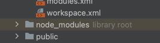
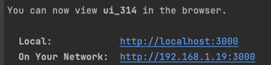
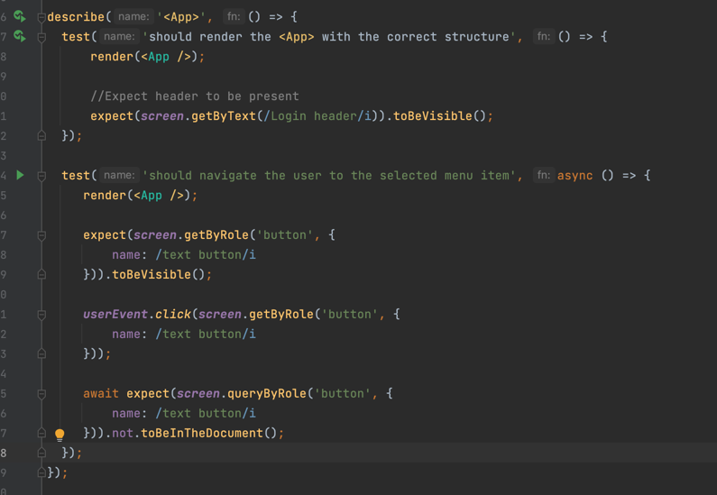
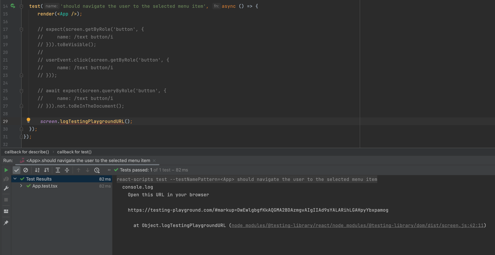
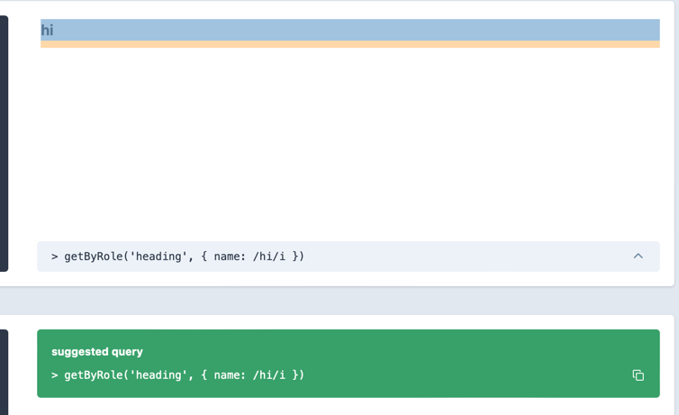

# Prerequisites

## Node JS
Install Node JS from: https://nodejs.org/en/download/

To check the version of Node JS that is running on your machine:

```node -v``` in terminal/command prompt

in a terminal will return the version number (which at the time of creating this project was v18.15.0).

# Setup
## Install dependencies
To install dependencies (as outlined in _package.json_):

```npm install```

This will need to be done anytime there is a change in the file (upgrading versions, installing new dependencies).
When you `npm install`, both the _package-lock.json_ file, and the **node_modules** folder will be generated.


**Note:** Sometimes, installed nodes or _package-lock.json_ have issues (you may see errors when trying to run the front-end). When this happens,
it is safe to delete the whole folder _**node_modules**_, and/or the _package-lock.json_ file, and re-run ```npm install```,
as this command generates this folder (with contents) and the _package-lock.json_ file again.

Also, occasionally, Git will say there are changes in _package_lock.json_ (also generated when you run `npm install`), and suggest
you push these changes when you push your branch. We shouldn't push _package_lock.json_ unless
there are changes in _package.json_ that you are pushing too.

# Running the UI
`npm start` will run the front end locally (currently on port 3000). This can be accesed via the link that appears in the terminal:


This port will need to change if it conflicts with the back-end (if we need to run them together).

# Unit Tests
**Example**:


Each test will follow a similar pattern:
1. Render the component being tested (example above: <App />)
2. Check what the test intends to check. Each test should have a specific function. For example, the first test just checks the component renders with the expected structure. The second test checks that a button is no longer on the screen after the user clicks it

If tests are failing, and you need to check what actually gets rendered in the test DOM:
1. Comment out the content of the test that is failing
2. Leave the `render(<{Component} />`, and a single line: `screen.logTestingPlaygroundURL())`
3. Run the test. In the **Run** tab, a URL will be generated. If you click this, it will take you to a page that shows you what the DOM rendered.
This will also give some information about what commands you can enter in the test to access particular elements. E.g.,



